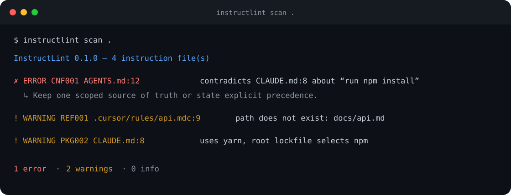

# InstructLint

**Lint the instructions that guide your coding agents.**

[](https://github.com/Neohu-ceo/instructlint/actions/workflows/ci.yml)
[](LICENSE)
[](https://www.python.org/)

Repositories now carry overlapping instructions for Codex, Claude Code, Cursor,
GitHub Copilot, Gemini, Windsurf, and reusable skills. Those files are executable
context: a stale path wastes a run, a contradictory rule produces inconsistent
changes, and a dangerous command can cause real damage.

InstructLint scans that layer locally, with no model, API key, telemetry, or
runtime dependencies.



## What it catches

- Contradictory `must` / `never` rules across tools and directory scopes
- Missing `@imports`, Markdown links, and repository-relative paths
- Destructive shell and Git commands presented as approved instructions
- Cursor and Copilot path rules with missing activation metadata
- Package-manager commands that disagree with the committed lockfile
- Duplicated normative rules that are likely to drift
- Oversized or empty context files and broken instruction symlinks
- Root guidance that never tells an agent how to verify its work

Recognized sources include `AGENTS.md`, `AGENT.md`, `CLAUDE.md`, `GEMINI.md`,
`SKILL.md`, `.cursorrules`, `.cursor/rules/`, Copilot instruction files,
Windsurf, Cline, Roo, Amazon Q, and JetBrains rule directories.

## Install

From GitHub:

```bash
pipx install git+https://github.com/Neohu-ceo/instructlint.git
```

Or with uv:

```bash
uv tool install git+https://github.com/Neohu-ceo/instructlint.git
```

For local development:

```bash
git clone https://github.com/Neohu-ceo/instructlint.git
cd instructlint
python -m pip install -e .
```

## Use

Scan a repository:

```bash
instructlint scan .
```

Make warnings fail CI:

```bash
instructlint scan . --fail-on warning
```

Emit machine-readable output:

```bash
instructlint scan . --format json
instructlint scan . --format sarif > instructlint.sarif
```

Explain which recognized instructions can affect one path:

```bash
instructlint explain src/api/client.py --tool cursor
```

Exclude intentional fixtures or generated trees with `.instructlintignore`
(gitignore-style glob lines):

```gitignore
examples/conflicted-repo/**
generated/**
```

`explain` is a transparent compatibility model, not a claim that every vendor
loads context identically. It reports path scope and activation metadata so you
can see likely overlap before opening an agent session.

## Example

```text
$ instructlint scan examples/conflicted-repo
InstructLint 0.1.1 — 3 instruction file(s)
✗ ERROR   CNF001 AGENTS.md:3  contradicts CLAUDE.md:3 about “use npm installs”
! WARNING REF001 AGENTS.md:5  path reference does not exist: docs/architecture.md
! WARNING PKG002 CLAUDE.md:4  instruction uses yarn, but the root lockfile selects npm

1 error(s), 2 warning(s), 0 info
```

## CI

The reusable action installs and runs InstructLint without an API key or write
permissions:

```yaml
name: Agent instruction lint
on:
  pull_request:
  push:
    branches: [main]

jobs:
  instructlint:
    runs-on: ubuntu-latest
    steps:
      - uses: actions/checkout@v4
      - uses: Neohu-ceo/instructlint@v0.1.1
        with:
          fail-on: warning
```

Inputs are `path`, `fail-on`, `format`, `max-bytes`, and `python-version`.
Pinning the exact release keeps CI reproducible.

## Where it fits

| Tool | Primary job |
| --- | --- |
| **InstructLint** | Find defects and drift in instruction files you already have |
| [Ruler](https://github.com/intellectronica/ruler) | Distribute shared rules to multiple agents |
| [agent-readiness](https://github.com/kodustech/agent-readiness) | Score how ready an entire codebase is for coding agents |
| [AGENTS.md](https://github.com/agentsmd/agents.md) | Define an open instruction-file convention |

InstructLint is intentionally complementary: use a standard to author, a sync
tool to distribute, and this linter to keep the result safe and coherent.

## Design principles

- **Local-first:** repository text never leaves the machine.
- **Deterministic:** the same tree produces the same diagnostics.
- **Conservative:** risky findings fail by default; style advice does not.
- **Composable:** text for humans, JSON for scripts, SARIF for code scanning.
- **Small:** Python standard library only at runtime.

See the [rule reference](docs/rules.md), [research notes](docs/research.md), and
[roadmap](ROADMAP.md). Contributions and real-world fixtures are welcome.

## License

MIT
